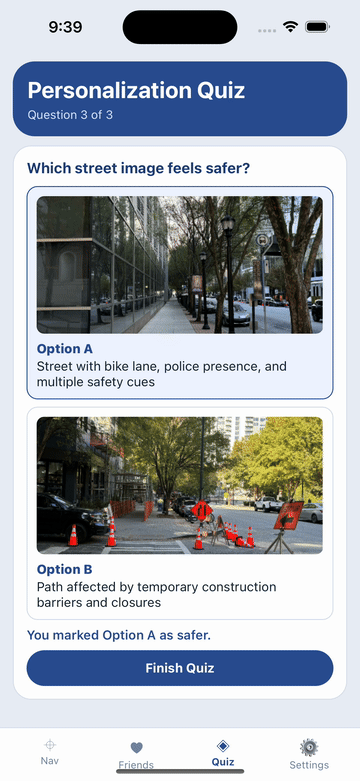

# SafeSt
The app scope covers onboarding-based personalization, route comparison, safety alerts, peer connectivity, and emergency support actions in one flow.

## Algorithm Design: Safety Score Calculation
The core route-ranking engine uses a weighted safety score combining street lighting, pedestrian density, open businesses, incident reports, surveillance presence, and environmental conditions. Weights adapt to user preference signals from onboarding. This creates a personalized decision function where the same source-destination pair can produce different route rankings based on user comfort preferences.

## Route Recommendation Engine
SafeSt generates candidate routes and attaches interpretable route-level labels.Rather than a single static best path, the app presents a ranked set to support informed user choice while preserving transparency on why each route was surfaced.

## Evaluation Logic and Decision Flow
We modeled user-choice correlation as a progressive elimination/check mechanism inspired by round-robin comparison to align route traits with selected safety factors.As onboarding responses accumulate, factor weights and route compatibility are re-evaluated, producing updated recommendations that remain explainable. This evaluation framing helped us validate that route suggestions were both preference-aware and consistent with observed street characteristics.
## Demo

### Map Route Logic


### Personalization Quiz


## Run

```bash
cd "/Project/safe-st"
npm install
npm run start
```

Then:
- Press `i` for iOS simulator
- Press `a` for Android emulator
- Or scan the QR code with Expo Go

## Implemented
- Real map rendering using `react-native-maps`
- Current location support via `expo-location`
- Typed origin/destination geocoding via Nominatim
- Multi-route walking alternatives via OSRM (`Route A/B/C`)
- Safety scoring per route:
  - street-lamp density (OpenStreetMap Overpass)
  - crowd unsafe reports near route
  - route duration and time-of-day adjustment
- User unsafe-point reporting:
  - report from current location during walk
  - red markers shown on map
- Multi-stage navigation flow (search, route options, walking, arrived)
